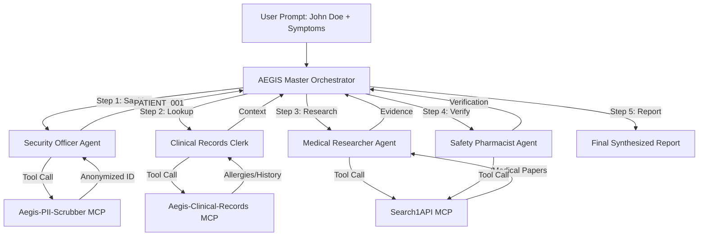

```mermaid
graph TD
    User[User Prompt: John Doe + Symptoms] --> Master[AEGIS Master Orchestrator]
    Master -->|Step 1: Sanitize| Security[Security Officer Agent]
    Security -->|Tool Call| PII_MCP[Aegis-PII-Scrubber MCP]
    PII_MCP -->|Anonymized ID| Security
    Security -->|PATIENT_001| Master
    Master -->|Step 2: Lookup| Clerk[Clinical Records Clerk]
    Clerk -->|Tool Call| DB_MCP[Aegis-Clinical-Records MCP]
    DB_MCP -->|Allergies/History| Clerk
    Clerk -->|Context| Master
    Master -->|Step 3: Research| Researcher[Medical Researcher Agent]
    Researcher -->|Tool Call| Search_MCP[Search1API MCP]
    Search_MCP -->|Medical Papers| Researcher
    Researcher -->|Evidence| Master
    Master -->|Step 4: Verify| Pharmacist[Safety Pharmacist Agent]
    Pharmacist -->|Tool Call| Search_MCP
    Pharmacist -->|Verification| Master
    Master -->|Step 5: Report| Final[Final Synthesized Report]
```