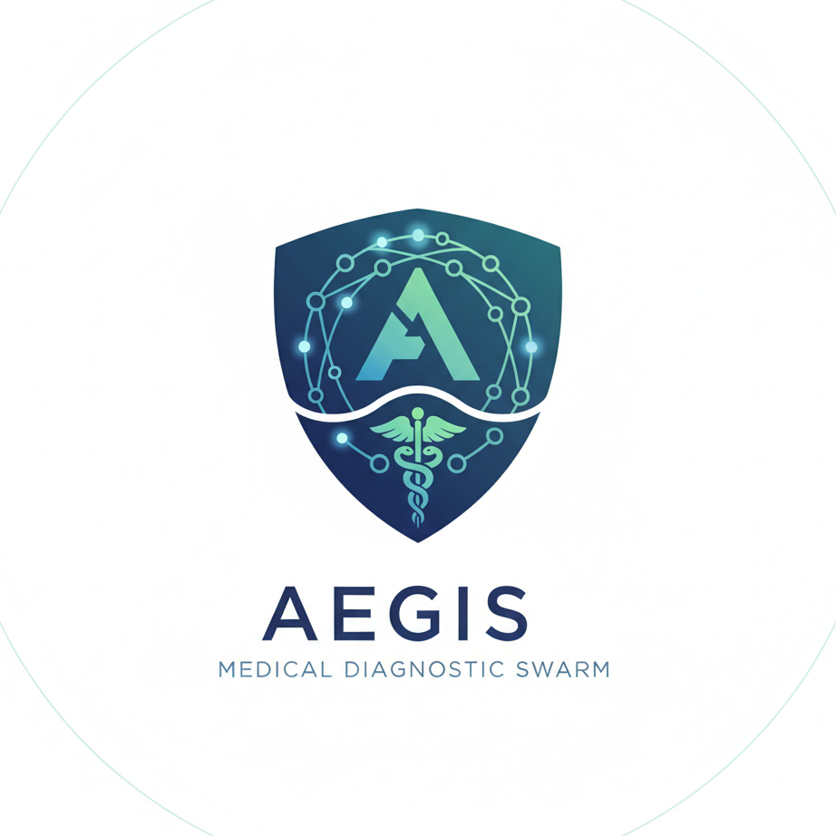
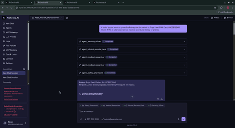
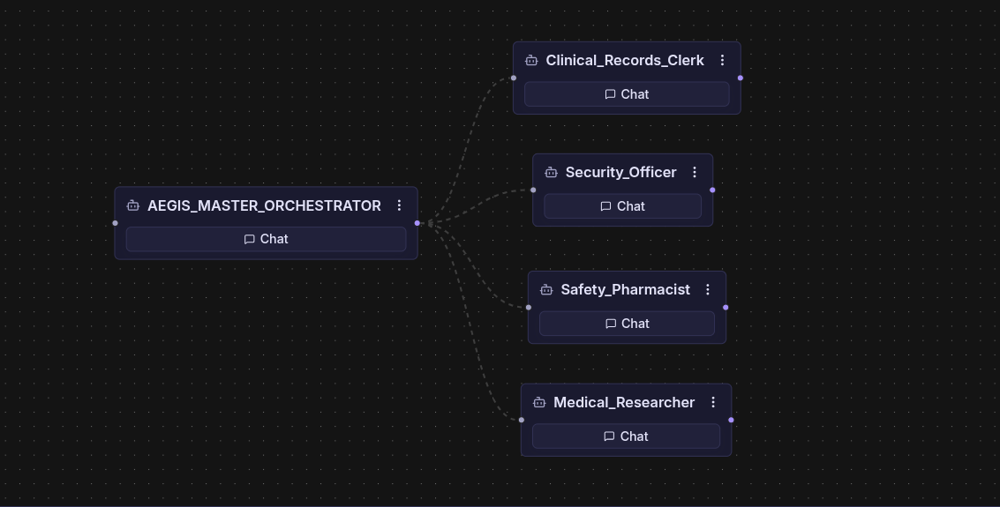
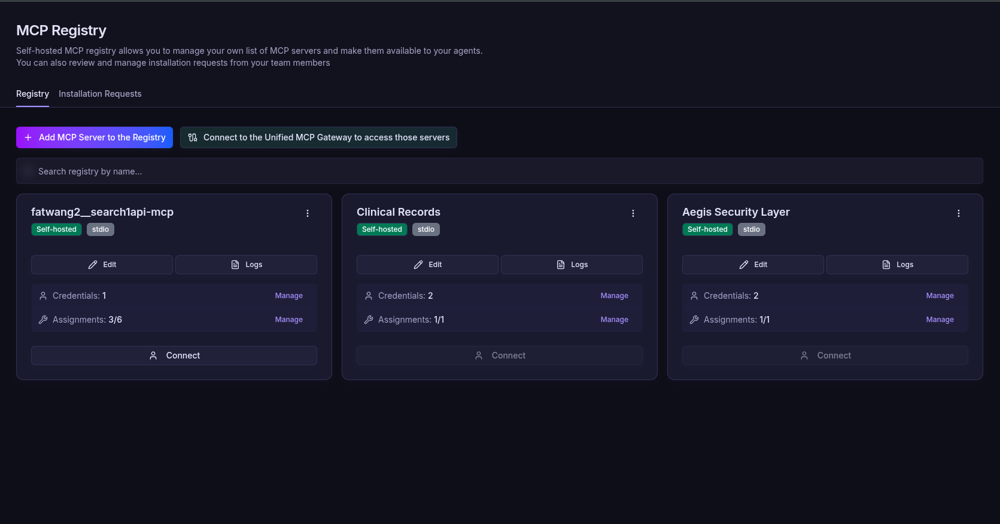

# AEGIS: Privacy-Preserving AI Medical Swarm




## The Vision

AEGIS is a multi-agent medical diagnostic swarm built on Archestra (Demo below shows a single-step interaction logic).



**Technical Highlights:**

- **Custom Python MCP Servers**: Created a PII redaction layer and a private SQLite EHR integration.
- **Multi-Agent Swarm Logic**: Orchestrated 4 sub-agents to perform sanitization, context retrieval, medical research, and pharmaceutical verification.
- **Privacy by Design**: Ensures HIPAA compliance by redacting sensitive data at the infrastructure level using the Model Context Protocol.
- **Observability**: Leverages Archestra's logs to provide a transparent, auditable clinical decision trail.

We solve the AI "Black Box" and "Privacy" problems in modern healthcare.

## SOTA Features

- **Advanced PII Scrubber**: Integrated with **Microsoft Presidio** for high-accuracy NER-based redaction of Names, SSNs, Emails, and more.
- **Global PII Support**: Custom support for Indian identifiers, including **Aadhaar**, **PAN Card**, and **Indian Phone Numbers**, ensuring compliance with both HIPAA (US) and DISHA (India).
- **Intelligent Identity Mapping**: Automatically maps detected names to deterministic Patient IDs for seamless cross-agent clinical lookups.
- **Live Context Integration**: Connects directly to hospital EHRs (simulated via a Python-SQLite MCP) with pre-seeded multi-national patient data.
- **Multi-Agent Verification**: Implements a "Pharmacist Guardrail" agent that peer-reviews the AI's own suggestions to prevent lethal drug interactions.
- **Zero-Trust Observability**: Full audit trails in Archestra prove exactly which data source triggered a medical warning.

## Clean Architecture



AEGIS utilizes a Swarm Orchestration pattern. Instead of one giant, hallucination-prone prompt, the workload is split into specialized units:

- **Security Officer (Agent)**: Uses the Aegis-PII-Scrubber MCP to redact names/SSNs.
- **Clinical Clerk (Agent)**: Uses the Aegis-Clinical-Records MCP to fetch history from a private SQLite DB.
- **Medical Researcher (Agent)**: Uses Search1API to find the latest peer-reviewed literature.
- **Safety Pharmacist (Agent)**: A specialized verification agent that only looks for contraindications.
- **Master Orchestrator**: The "Senior Attending" that synthesizes the final report.

## Technical Stack



- **Platform**: Archestra (Dockerized)
- **Protocol**: Model Context Protocol (MCP)
- **Intelligence**: Llama-3.3-70b (via Groq for ultra-low latency)
- **Custom Servers**: Python-based FastMCP servers for Security and Data layers.
- **Database**: SQLite (Embedded Clinical Records).

## 🚀 Quick Links
- **[Installation & Setup](#installation--setup)**: Docker-based setup.
- **[Local Usage Guide](USAGE.md)**: How to run without Docker.
- **[Requirements](requirements.txt)**: List of Python dependencies.

## Installation & Setup

0. **Install Archestra**

   **Linux / macOS:**

   ```bash
   docker pull archestra/platform:latest
   docker run -p 9000:9000 -p 3000:3000 \
      -e ARCHESTRA_QUICKSTART=true \
      -v /var/run/docker.sock:/var/run/docker.sock \
      -v archestra-postgres-data:/var/lib/postgresql/data \
      -v archestra-app-data:/app/data \
      archestra/platform
   ```

   **Windows (PowerShell):**

   ```powershell
   docker pull archestra/platform:latest
   docker run -p 9000:9000 -p 3000:3000 `
      -e ARCHESTRA_QUICKSTART=true `
      -v /var/run/docker.sock:/var/run/docker.sock `
      -v archestra-postgres-data:/var/lib/postgresql/data `
      -v archestra-app-data:/app/data `
      archestra/platform
   ```

1. **Build MCP Servers**

   ```bash
   # Clone the repo
   git clone https://github.com/akashadsare/AEGIS.git
   cd AEGIS

   # Build the Security & Data containers
   docker build -f Dockerfile.pii -t aegis-pii .
   docker build -f Dockerfile.db -t clinical-db .
   ```

2. **Inject into Archestra**

   Inject these local images into your Archestra-managed Kubernetes cluster:

   ```bash
   docker save aegis-pii:latest | docker exec -i [KIND_CONTAINER_ID] ctr -n k8s.io images import -
   docker save clinical-db:latest | docker exec -i [KIND_CONTAINER_ID] ctr -n k8s.io images import -
   ```

   Replace `[KIND_CONTAINER_ID]` with your KinD control plane container ID (e.g., `b65a4718f4d0`). You can find it by running `docker ps` and looking for the `kindest/node` image.

   For this setup, run:
   ```bash
   docker save clinical-db:latest | docker exec -i archestra-mcp-control-plane ctr -n k8s.io images import -
   docker save aegis-pii:latest | docker exec -i b65a4718f4d0 ctr -n k8s.io images import -
   ```

3. **Connect Servers in UI**

   In the Archestra MCP Registry, add:

   - Aegis Security: Image aegis-pii, Command python, Arg /app/pii_server.py.
   - Clinical Records: Image clinical-db, Command python, Arg /app/clinical_server.py.
   - Search API: Add the fatwang2__search1api-mcp MCP server for medical research and verification.

4. **Configure Agents**

   Create the sub-agents first:

   **Agent A: The Gatekeeper (Security)**  
   Click: + Create Agent  
   Name: Security_Officer  
   Tools: Select scrub_medical_notes (from your Aegis Security Layer).  
   System Prompt:  
   ```
   Your ONLY purpose is to ensure privacy. Take the user's raw medical notes and run them through the scrub_medical_notes tool. Return the exact output from that tool. Do not add your own medical advice.
   ```

   **Agent B: The Records Clerk (Data)**  
   Click: + Create Agent  
   Name: Clinical_Records_Clerk  
   Tools: Select get_patient_data (from your Clinical Records server).  
   System Prompt:  
   ```
   You are a hospital database assistant. You receive patient IDs (like PATIENT_001) and use the get_patient_data tool to find their medical history and allergies. Provide a clear summary of what you find.
   ```

   **Agent C: The Medical Researcher (Research)**  
   Click: + Create Agent  
   Name: Medical_Researcher  
   Tools: Select the tools from fatwang2__search1api-mcp (likely named search, google_search, etc.).  
   System Prompt:  
   ```
   You are a world-class medical researcher. Use your search tools to find current medical literature, drug interactions, and standard of care for the symptoms provided. Cite your sources (URLs/Journal names).
   ```

   **Agent D: The Safety Pharmacist**  
   In the Archestra sidebar, click on Agents.  
   Click + Create Agent.  
   Name: Safety_Pharmacist  
   Model: Select the same Groq/Llama model you used for the others.  
   Tools: Select your medical search tool (fatwang2__search1api-mcp).  
   System Prompt:  
   ```
   You are a Senior Safety Pharmacist. Your ONLY job is to peer-review the recommendations of other doctors.
   Your Process:
   Look at the patient's medical history and allergies provided.
   Look at the suggested medication.
   Use your search tools to find if there are any LETHAL interactions or contraindications (e.g., specific risks for pregnancy or diabetes).
   Output Requirements:
   If the medication is safe, say: 'GREEN LIGHT: No major safety concerns found.'
   If you find a risk, say: 'RED ALERT: [Reason why it is dangerous]'. Suggest a safer class of drugs if possible.
   ```

   **Finally, create and configure the Master Orchestrator (AEGIS_MASTER_ORCHESTRATOR):**  
   Go to the Agents tab.  
   Click + Create Agent (or Edit if it exists).  
   Name: AEGIS_MASTER_ORCHESTRATOR  
   Model: Select the same Groq/Llama model.  
   Tools: None (or as needed).  
   Sub-agents: Add Security_Officer, Clinical_Records_Clerk, Medical_Researcher, and Safety_Pharmacist.  
   System Prompt:  
   In the Sub-agents dropdown, add Safety_Pharmacist. (Ensure Security_Officer, Clinical_Records_Clerk, and Medical_Researcher are still selected).  
   Update the System Prompt to include this new step:  

   ```
   You are AEGIS, a Medical Diagnostic Swarm.
   YOUR MANDATORY WORKFLOW:
   SANITIZE: Pass input to Security_Officer.
   CONTEXT: Use the ID to ask Clinical_Records_Clerk for history/allergies.
   RESEARCH: Ask Medical_Researcher for a diagnosis and treatment based on symptoms and history.
   4. SAFETY CHECK: Send the Medical_Researcher's suggestion and the patient history to the Safety_Pharmacist. They will provide a final verification.
   SYNTHESIZE: Produce the final report only after the Pharmacist provides a GREEN LIGHT.
   CRITICAL: If the Pharmacist issues a RED ALERT, you must highlight this prominently in the recommendation section of your report.
   ```

## Demo

**Scenario: The Penicillin Trap**

User Prompt: "Patient John Doe (SSN: 123-45-6789) has severe throat swelling and needs antibiotics. What is the safest course of action?"

**The AEGIS Response Flow:**

- **Redaction**: The system immediately swaps "John Doe" for `PATIENT_001` or "Rahul Sharma" for `PATIENT_003`, while redacting Aadhaar/SSN.
- **Context Discovery**: The system queries the clinical database and discovers `PATIENT_001` has a documented Penicillin Allergy or `PATIENT_004` has G6PD deficiency.
- **Research**: The researcher finds that for severe throat swelling, Clindamycin is the preferred alternative for penicillin-allergic patients.
- **Verification**: The Safety Pharmacist issues a GREEN LIGHT for Clindamycin but a RED ALERT for any Beta-lactam suggestion.
- **Synthesis**: The user receives a comprehensive report with dosage, rationale, and citations.

### Demo in Action

**Watch the Full Narrated Demo:**
[](https://youtu.be/ElzP7QXlmlk)

---

## Test Prompts for Demo

Use these prompts to test the full AEGIS swarm integration:

### 1. The Penicillin Trap (US Context)
> "I have a patient, **John Doe (SSN: 123-45-6789)**. He has severe throat swelling and needs antibiotics. He is currently in the ER and the resident suggested **Penicillin**. What is the safest course of action?"
*   **Tests**: SSN redaction, Penicillin allergy lookup, alternative antibiotic research.

### 2. The Chronic Asthma Case (India Context)
> "Patient **Rahul Sharma (Aadhaar: 1234 5678 9012)** is complaining of acute shortness of breath and chest tightness. He is visiting from Delhi. Please look up his history and suggest a stabilization protocol."
*   **Tests**: Aadhaar redaction, Indian name mapping to `PATIENT_003`, asthma history retrieval.

### 3. High-Risk Contraindication (G6PD Deficiency)
> "A junior doctor wants to prescribe **Primaquine** for malaria to **Priya Patel (PAN Card: ABCDE1234F)**. Check if this is safe based on her medical record and history of anemia."
*   **Tests**: PAN Card redaction, G6PD deficiency identification (PATIENT_004), Pharmacist RED ALERT for oxidant drugs.

### 4. Pregnancy Safety Guardrail
> "Patient **Jane Smith (SSN: 987-65-4321, Phone: +1-555-0123)** has a high fever and a bad urinary tract infection. We want to give her **Ciprofloxacin**. Verify if this is contraindicated for her right now."
*   **Tests**: Multiple PII redaction, Pregnancy status identification (PATIENT_002), safety check for pregnancy-safe antibiotics.

## Enterprise Readiness

- **Model Agnostic**: Can be swapped for local HIPAA-compliant models (like Med-Llama) with one click in Archestra.
- **Revocable Access**: Database access is governed by Archestra Tool Policies; access can be revoked instantly without touching code.
- **Scalable**: Designed to run on Kubernetes via Archestra's native orchestration.

"Ensuring the future of medical AI is private, accurate, and safe."

Made by Akash Adsare

--- 
*Note: This README and the comments within this project were generated using AI.*